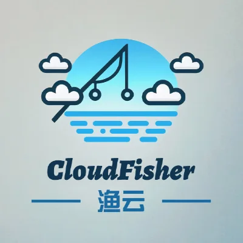

# 渔云机场：稳定高速的全球网络加速与流媒体服务

渔云机场（CloudFisher）为全球用户提供高速、稳定的网络加速服务，通过全 IEPL 专线技术，确保每一次连接都极速流畅。无论您需要浏览网页、观看流媒体视频，还是进行大文件传输，渔云机场都能满足您的高需求，带来极致的网络体验。

## **全 IEPL 专线服务：高效稳定的网络体验**

渔云机场的全 IEPL 专线服务，让您的网络连接更加稳定、快速。每 120GiB 流量仅需 7 元，结合大量 1倍率 IEPL 专线节点支持，确保您的网络体验无与伦比，特别适合需要高带宽、低延迟的场景。

## **流媒体服务：畅享Emby影视库**

渔云机场与知名流媒体平台 Emby 合作，凡订购月付套餐的用户可免费享受 Emby 影视库服务，观看成千上万部全球热门影片。但请注意，年付和不限时套餐用户暂不包含在内。

## **推广计划：轻松赚取佣金**

渔云机场推出了极具吸引力的推广计划，首次订单可获得高达 50% 的佣金，且佣金将在 72 小时内自动确认。累计佣金达到 250 元即可提现，未满部分也可用于站内消费，帮助推广者轻松获取额外收益。

## **订阅计划：多种选择，满足您的需求**

渔云机场提供多种套餐，以满足不同用户的需求。以下是各套餐详情：

| 套餐名称                | 费用         | 流量       | 速率     | 专线节点        |
|------------------------|--------------|------------|----------|----------------|
| Global Acceleration Plus| ¥15.00 /月   | 300GiB    | 最高600Mbps | 1倍率沪日专线   |
| Global Acceleration Lite| ¥7.00 /月    | 120GiB    | 最高300Mbps | 1倍率沪日专线   |
| Global Acceleration Max | ¥25.00 /月   | 500GiB    | 最高600Mbps | 1倍率沪日专线   |
| Global Acceleration Air | ¥60.00 /年   | 每月148GiB | 最高500Mbps | 1倍率沪日专线   |

## **常见问题 (FAQ)**

### 1. 渔云机场的网络速度如何？
渔云机场提供高达 600Mbps 的网络速度，确保用户体验快速、稳定的网络连接。

### 2. 套餐内的流量是每月还是总计？
所有套餐中的流量为每月流量，确保每月都能获得相应的网络资源。

### 3. 如何享受 Emby 影视库服务？
订购月付套餐的用户可免费享受 Emby 影视库服务，畅享上万部流媒体影片，随时随地观看。

### 4. 渔云机场是否提供推广计划？
是的，渔云机场提供了高佣金的推广计划，首次订单可获得 50% 的佣金，且佣金将在 72 小时内自动确认。

## **结语**

渔云机场为用户提供高效、稳定的网络加速服务，无论是浏览网页、观看流媒体还是大文件传输，都能提供流畅的体验。选择适合您的订阅计划，立刻享受全球网络的极速体验吧！

> 渔云机场 - IEPL 专线服务，低至每 120GiB 仅需 7 元，立即访问[官网](https://jump.p6p.net/165)订阅。
